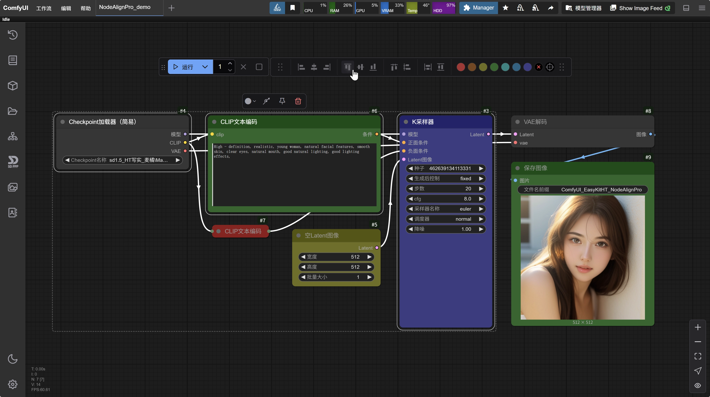
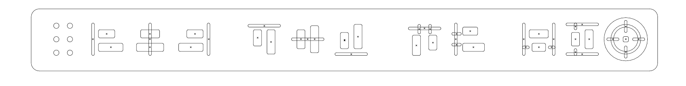
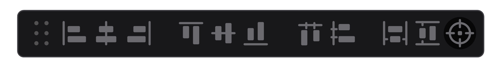

# ComfyUI_EasyKitHT_NodeAlign Pro 🎨

[](https://github.com/ArtsticH/ComfyUI_EasyKitHT_NodeAlignPro/stargazers)
[](LICENSE)
[](https://raw.githubusercontent.com/ArtsticH/ComfyUI_EasyKitHT_NodeAlignPro/README_ZH.md)
[](https://raw.githubusercontent.com/ArtsticH/ComfyUI_EasyKitHT_NodeAlignPro/README.md)


The newly designed ComfyUI node alignment and coloring plugin has completely redesigned and developed new UI icons and layouts. The layout of the alignment tool is more in line with the common operation logic and experience in the design industry. The position of the coloring tool is more reasonable, facilitating quick coloring.


## ✨ Core Features

| Intelligent Alignment System            | Enhanced Workflow               | 	Efficient Interaction Design             | 🔆 New UI Zoom Adaptation              |
|---------------------------|---------------------------|---------------------------|---------------------------|
| ✅ 8 Basic Alignment Modes        | 🎨 One-click Color Management Scheme      | 🖱️  Floating Tool Panel      | ✅ Added UI Zoom Button in the Right-click Menu     |
| 📐 Dynamic Spacing Distribution Algorithm        | 📏 Visual Layout Guide Lines       | ⌨️ Custom Shortcut Key Configuration       | 😁By default, clicking the "UI Zoom" button only</br>　 zooms the plugin components     |
| 👥 Multi-node Group Collaborative Operation        | 👁️ Real-time Preview of Adjustment Effects        | 💾 Layout Memory and Restoration System     | ❕Click the "UI Zoom" button with Ctrl to globally</br>　 zoom the page    |  

⚠️Note:`HT20250430-New UI Zoom Adaptation`  ((There is a slight bug causing "Incomplete display due to excessive global zoom", but "It does not affect basic usage" and will be fixed in the future. Therefore, you can currently use the basic UI zoom with confidence, that is, **directly click the "UI Zoom" button**).  

## 🖼️ Effect Demonstration

  
<video src="//player.bilibili.com/player.html?isOutside=true&aid=114426065716534&bvid=BV1V7G9z9EcU&cid=29714745695&p=1" controls="controls" width="500" height="300"></video>  


Function Update Records 


    
  

---

## 🛠️ Installation Guide

### Manual Installation
1. [Download the Latest Release](https://github.com/ArtsticH/ComfyUI_EasyKitHT_NodeAlignPro/releases)
2. Unzip it to the `ComfyUI/custom_nodes/` directory
3. Restart the ComfyUI service

### Git Installation
```bash
git clone https://github.com/ArtsticH/ComfyUI_EasyKitHT_NodeAlignPro.git custom_nodes/ComfyUI_EasyKitHT_NodeAlignPro
```
### 🚀 Quick Start
Example Workflow Configuration (for reference only)
```python
{
    "nodes": [
        {
            "type": "ComfyUI_EasyKitHT_NodeAlignPro/AlignGroup",
            "params": {
                "alignment_mode": "vertical_center",
                "spacing": 50,
                "color_scheme": "cyan"
            }
        }
    ]
}
```

## 📌 Function Details
- **Node Alignment**  
Left/Right/Top/Bottom Alignment, Horizontal/Vertical Centering, Smart Spacing Distribution

- **Node Coloring**  
7 Preset Color Schemes: orange, yellow, green, cyan, blue, purple, Custom Color Picker, One-click Reset


## 🤝 Contribution Guide
- Welcome to participate in the improvement in the following ways:  
`Submit Usage Feedback`、`New Issue`、`Improve Code Logic`、`Fork & PR`、`Complete Multilingual Documents`、`Share Creative Workflows`

## 📜 License Agreement
- This project uses the MIT License. The development idea is based on the secondary development of`ComfyUI-Align`and`ComfyUI-NodeAligner`.  
- It mainly refactored the code and rewrote the UI, thus developing the lightweight`ComfyUI_EasyKitHT_NodeAlignPro`named`ComfyUI插件`.  
- The core functions are: `Node Alignment`与and`Node Coloring`.


👨💻 This is a project developed by a designer in his spare time. Welcome to feedback on usage issues.
⚠️ There may be exceptions in untested scenarios. Please report them through Issues.