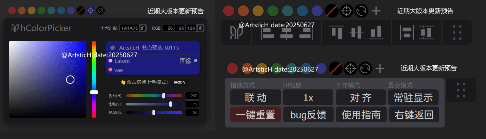
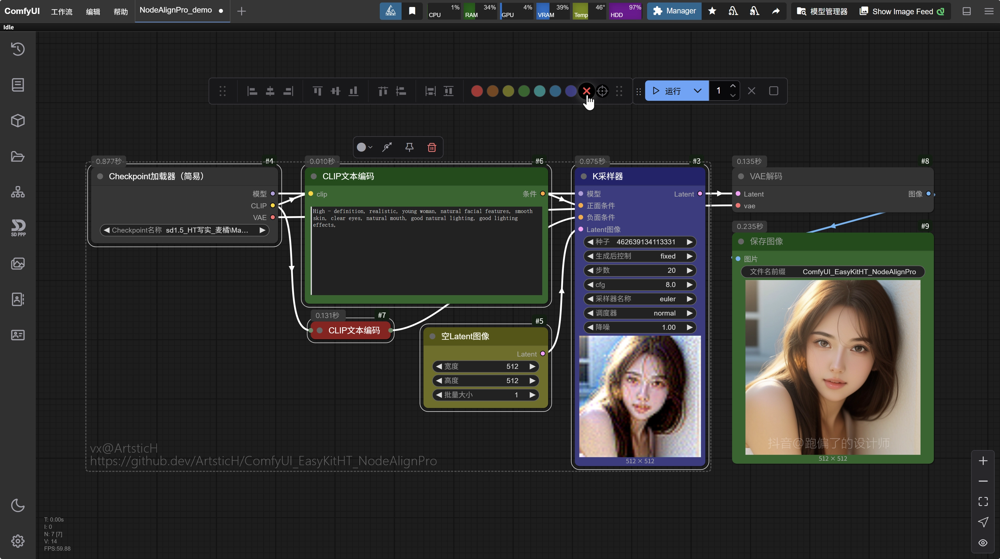

# ComfyUI_EasyKitHT_NodeAlign Pro 🎨

[](https://github.com/ArtsticH/ComfyUI_EasyKitHT_NodeAlignPro/stargazers)  [](LICENSE)  [](README_ZH.md)  [](README_ZH.md)


The newly designed ComfyUI node alignment and coloring plugin has completely redesigned and developed new UI icons and layouts. The layout of the alignment tool is more in line with the common operation logic and experience in the design industry. The position of the coloring tool is more reasonable, facilitating quick coloring.
## 🔥<font color=#22ee00> [+] </font>Update Preview (A Major Update for the Upcoming Version 😁)↓↓↓↓
<font color=#22ee00> [+] </font>The basic code and concept were basically completed in June-July of this year. Due to my recent busyness, the update has been on hold for a long time. Please be patient and wait; we will strive to launch the major update version before the National Day (see the picture below 👇). Thank you for your support and understanding!


## ✨ Core Features (Coming Soon)

| 💫Intelligent Alignment System | <font color=#22ee00> [+]</font>💫New Coloring System | <font color=#22ee00> [+]</font>💫User-Friendly Interaction Design | <font color=#22ee00> [+]</font>💫New Color Picker (Original Design) |
|---------------------------|---------------------------|---------------------------|---------------------------|
| ✅ 8 Basic Alignment Modes | <font color=#22ee00> [+]</font>🖼️ One-Click Color Management Solution | 🖱️ Floating Tool Panel | <font color=#22ee00> [+]</font>✅ New Color Picking System Implemented with Native JS/CSS |
| 📐 Dynamic Spacing Distribution Algorithm | <font color=#22ee00> [+]</font>🔗 Real-Time Linked Display of Color Picking Effect | <font color=#22ee00> [+]</font>🧩 New Custom Configuration | <font color=#22ee00> [+]</font>🎨 Color Card Modes: Color/Gray Scale/Custom |
| 👥 Collaborative Operation of Multiple Node Groups | <font color=#22ee00> [+]</font>💾 Custom Color Card Collection and Restoration System | <font color=#22ee00> [+]</font>💾 Layout Memory and Restoration System | <font color=#22ee00> [+]</font>👏 Color Cards: Random/Collect/Remove/Manual Addition |  

⚠️Note: `HT20250430 - New UI Scaling Adaptation` (There is a minor bug causing `incomplete display due to excessive global scaling`, but it `does not affect basic usage` and will be fixed later. Therefore, you can currently **use the basic UI scaling with confidence**, i.e., **directly click the "UI Scaling" button**).  
⚠️<font color=#22ee00> [+] </font>Note: The three major modules - `💫New Coloring System`, `💫User-Friendly Interaction Design`, and `💫New Color Picker (Original Design)` - have all undergone restructuring to varying degrees, and the basic operation logic of the `v1.0.4_rc version` has been retained as much as possible. Everyone just needs to **wait patiently for the upcoming update**.

## 🖼️ Effect Demonstration

  

## ✅ Function Update Records  

 
  
  
  
<video src="https://player.bilibili.com/player.html?isOutside=true&aid=114426065716534&bvid=BV1V7G9z9EcU&cid=29714745695&p=1" controls="controls" width="500" height="300"></video>  
<video src="https://www.bilibili.com/video/BV1V7G9z9EcU/" controls="controls" width="500" height="300"></video>  

---

## 🛠️ Installation Guide

### Manual Installation
1. [Download the Latest Release](https://github.com/ArtsticH/ComfyUI_EasyKitHT_NodeAlignPro/releases)
2. Unzip it to the `ComfyUI/custom_nodes/` directory
3. Restart the ComfyUI service

### Git Installation
```bash
git clone https://github.com/ArtsticH/ComfyUI_EasyKitHT_NodeAlignPro.git custom_nodes/ComfyUI_EasyKitHT_NodeAlignPro
```
### Git update (Manual navigation to the ComfyUI_EasyKitHT_NodeAlignPro directory is required first)
```bash
git fetch --all
```

### 🚀 Quick Start
Example Workflow Configuration (for reference only)
```python
{
    "nodes": [
        {
            "type": "ComfyUI_EasyKitHT_NodeAlignPro/AlignGroup",
            "params": {
                "alignment_mode": "vertical_center",
                "spacing": 50,
                "color_scheme": "cyan"
            }
        }
    ]
}
```

## 📌 Function Details
- **Node Alignment**  
Left/Right/Top/Bottom Alignment, Horizontal/Vertical Centering, Smart Spacing Distribution

- **Node Coloring**  
7 Preset Color Schemes: orange, yellow, green, cyan, blue, purple, Custom Color Picker, One-click Reset


## 🤝 Contribution Guide
- Welcome to participate in the improvement in the following ways:  
`Submit Usage Feedback`、`New Issue`、`Improve Code Logic`、`Fork & PR`、`Complete Multilingual Documents`、`Share Creative Workflows`

## 📜 License Agreement
- This project uses the MIT License. The development idea is based on the secondary development of[ComfyUI-NodeAligner](https://github.com/Tenney95/ComfyUI-NodeAligner) and [ComfyUI-Align](https://github.com/Moooonet/ComfyUI-Align).  
- It mainly refactored the code and rewrote the UI, thus developing the lightweight[ComfyUI_EasyKitHT_NodeAlignPro](https://github.com/Tenney95/ComfyUI-NodeAligner)named`ComfyUI plugin`.  
- The core functions are: `Node Alignment`and`Node Coloring`.

👨💻 This is a project developed by a designer in his spare time. Welcome to feedback on usage issues.
⚠️ There may be exceptions in untested scenarios. Please report them through Issues.