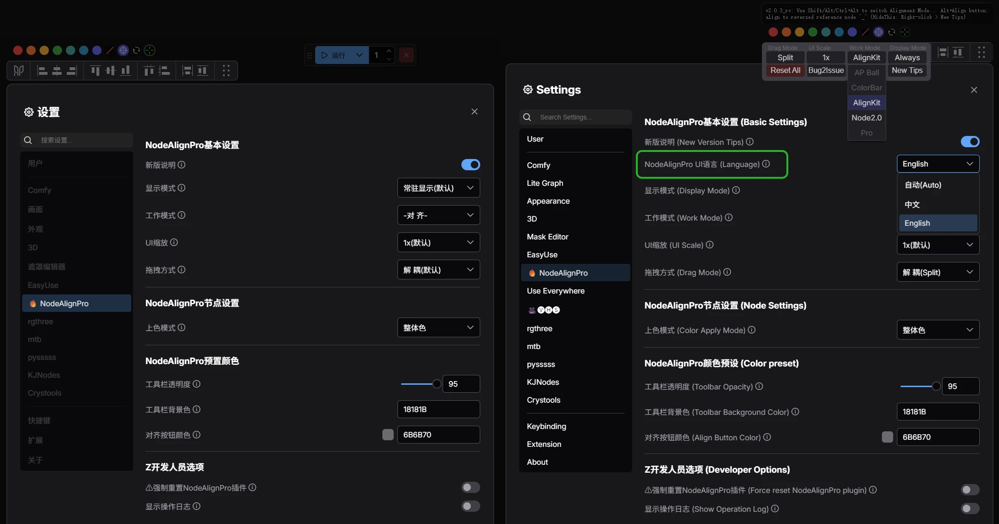

# EasyKit-NodeAlign-Pro [↙切换中文] 🎨

[](https://github.com/ArtsticH/ComfyUI_EasyKitHT_NodeAlignPro/stargazers)  [](LICENSE)  [](README_ZH.md)  [](README.md)

## 📋 Project Overview

**EasyKit-NodeAlign-Pro**, independently developed by a designer (formerly: ComfyUI_EasyKitHT_NodeAlign Pro):

**v2.1.13: 🔥First-to-support the latest ComfyUI Node2.0 nodes. Pioneering Node2.0-based alignment algorithm (Innovative adaptation)**: An essential plugin for managing node layout and color schemes in ComfyUI, featuring professional alignment tools and a real-time node color picker. **Now fully compatible with ComfyUI Node2.0**. Key functions include alignment distribution, real-time node color picker, color palette, 7 preset colors, grayscale/custom modes, and one-click reverse alignment. It provides a new suite of alignment tools and a professional node color management system. The layout of the built-in alignment tools follows industry-standard logic for a better user experience, and the versatile coloring tool offers multiple intuitive coloring modes. (Natively supports multi-language UI display).

Features an original node-based real-time color preview/picker component for quick node coloring. This plugin is designed to boost ComfyUI users' productivity by simplifying node layout and color management through an intuitive interface and rich feature set.

---

## 🔥 What's New in v2.1 (Enhanced Alignment for ComfyUI Node 2.0)

**The new v2.0 is fully adapted with an i18n multilingual configuration file, natively supporting languages like Chinese, English (and can be extended in the future to support more languages such as Russian, French, etc.), making it more user-friendly for friends around the world.**
While preserving the UI and interaction habits of the previous version as much as possible, the interface interaction logic has been fine-tuned, and the UI continues to be iteratively updated (see images below).

#### ✅【Update 260125】: Added ComfyUI menu, new i18n multilingual adaptation (now integrated into the official menu page)👇



#### If you like it, feel free to give it a **⭐Star**! Your encouragement is my greatest motivation!

<details>
  <summary><b>⚠️ Legacy v1.0.4_rc UI...</b></summary>

**Legacy v1.0.4_rc**: Only provided basic node alignment tools and a fixed coloring tool:

</details>

## ✨ Core Features (Officially Released)

| 💫 Node 2.0 Alignment System | 💫 New Coloring System     | 💫 User-Centric Design     | 💫 New Color Picker (Original Design) |
|------------------------------|----------------------------|----------------------------|---------------------------------------|
| 🔥 **New Node 2.0 Algorithms** | 🖼️ One-Click Color Mgmt.  | 🖱️ Hovering Tool Panel     | ✅ **Original Real-Time Preview Color Picker/Adjuster** |
| 📐 **Original Alt Reverse-Baseline Algo.** | 🔗 Live Full-Screen Picker | ⚙️ New Custom Configuration | 🎨 Color Mode: Colorful/Grayscale/Custom |
| 📊 Two Alignment/Distribution Algorithms | 🎨 Whole Node/Title-Only Coloring | 💾 Layout Memory & Restore | 🧩 Swatches: Random/Favorite/Remove/Manual |
| 🧩 Multiple Alignment Modes  | 🧩 Custom Swatch Favorites & Restore | 🌐 Native i18n Multilingual | 🎨 Presets: Specially Tuned Color Values |

#### 🎯 Advanced Features
- **i18n Multilingual**: Natively adapted i18n multilingual system.
- **Node 2.0 Support**: Brand new support for ComfyUI Node 2.0 nodes.
- **ComfyUI System Menu Integration**: Permanently visible or auto-shown with selection.
- **Custom Drag & Scale**: Freely draggable and scalable operation panel.
- **AcBar Link Mode**: Linked positioning with ComfyUI's Run button.
- **Right-Click Menu**: Rich settings and quick actions.
- **Batch Node Selection**: Multiple selection tools and magic wand (In development/debugging...).
- **Batch Node Renaming**: Batch rename node feature (In development/debugging...).

#### 🎨 Color Management Module
- **Two Coloring Modes**: Color only node title / Color entire node 【Added in v2.0.3_rc】.
- **Seven Preset Color Groups**: Quickly apply standard colors to selected nodes.
- **Grayscale Palette**: Hold **Shift** to switch to grayscale mode 【Added in v2.0.1_rc】.
- **Custom Palette**: Hold **Alt** to enter custom color mode 【Added in v2.0.1_rc】.
- **Color Favorites**: **Ctrl+Alt** to lock/unlock custom colors 【Added in v2.0.1_rc】.
- **Random Color**: Click the random color button for one random color 【Added in v2.0.1_rc】.
- **Super Random Colors**: **Alt** + **Random Color Button** randomizes 7 colors at once and applies them in real-time to selected nodes 【Added in v2.0.1_rc】.
- **Live Color Picker**: Built-in **Full-Screen Live Color Picker** 【Added in v2.0.1_rc】 (Zero dependencies, pure native JS+CSS).
- **Node Color Adjustment Live Preview Component**: Original real-time preview color adjuster/picker component based on nodes 【Added in v2.0.1_rc】 (Zero dependencies, pure native JS+CSS).

#### 🔧 Node Alignment Module
- **Basic Alignment**: Left, Right, Top, Bottom.
- **Center Alignment**: Vertical Center and Horizontal Center.
- **Even Distribution**: Horizontal Even Distribution and Vertical Even Distribution.
- **Uniform Sizing**: Equal Width and Equal Height.
- **Reverse-Baseline Mode**: **Alt** + Click corresponding **Alignment Button** for reverse-baseline alignment 【Added in v2.0.1_rc】.

---

## 🚀 Installation

#### Method 1: Via ComfyUI Manager (Recommended)
1. Search for "**NodeAlign Pro**" in **ComfyUI Manager** (note the space before "Pro").
2. Find `EasyKit-NodeAlign-Pro`, click Install `(This method installs the ComfyUI registered plugin version: will auto-generate the official easykit-node-align directory)`.
3. Wait for prompt, restart ComfyUI.

#### Method 2: Git Clone (Recommended)
1. Navigate to your ComfyUI/custom_nodes directory, run `(This method installs the git version: will auto-generate the ComfyUI_EasyKitHT_NodeAlignPro directory)`:
```
git clone https://github.com/ArtsticH/ComfyUI_EasyKitHT_NodeAlignPro.git
```

- For users in China or those who cannot access GitHub, use the Gitee mirror:
```
git clone https://gitee.com/ArtsticH/ComfyUI_EasyKitHT_NodeAlignPro.git
```

3. Restart ComfyUI.

#### Method 3: Comfy Install
`(This method installs the ComfyUI registered plugin version: will auto-generate the official easykit-node-align directory)`
```
comfy node install easykit-node-align
```

#### Method 4: Manual Git Install
1. Go to the project page: https://github.com/ArtsticH/ComfyUI_EasyKitHT_NodeAlignPro
2. Download the ZIP (`<>Code` > `Download ZIP`).
3. Extract to `ComfyUI/custom_nodes` directory (Ensure correct path: `ComfyUI/custom_nodes/ComfyUI_EasyKitHT_NodeAlignPro`).
4. Restart ComfyUI.

## 🚀 Plugin Update

#### Method 1: Update via ComfyUI Manager (Recommended)
1. In **ComfyUI Manager**, search for "**NodeAlign Pro**" (note the space before "Pro").
2. Find `EasyKit-NodeAlign-Pro`, click Install/Update.
3. Wait for prompt, restart ComfyUI.

#### Method 2: Git Update (Navigate to ComfyUI_EasyKitHT_NodeAlignPro directory first)
```
git fetch --all && git reset --hard origin/main
```

---

#### 🚀 Quick Start (Brief Guide)
After successful installation, basic operations (for reference).

1. **Color a Node**: In ComfyUI, select any node(s) > click any **color button** in the NodeAlignPro panel (hereafter NAP panel) (🔴🟠🟡🟢🔵🟣🟤, `Clear Color` `Color Picker` `Random Color`).
2. **Custom Color**: Select any node(s) > click the **Color Picker button** in the NAP panel.
3. **Align Nodes**: Select any node(s) > click any **alignment button** in the NAP panel.
4. **Reverse-Baseline Alignment**: Select any node(s) > Hold **Alt** + Click the corresponding **alignment button** for reverse-baseline alignment.
    └ Example: `Left Align` → select multiple nodes > `Alt`+`Left Align Button` uses the `rightmost node` as the `baseline` for `left alignment` (Default left align uses the `leftmost node` as the `baseline`).
5. **Drag NAP Panel**: Without selecting any node > Click the buttons on either side of the NAP panel, wait for the four-way arrow cursor (↕↔) to appear, then drag.
6. **Reset Settings**: Without selecting any node > Right-click within the NAP panel > 【One-Click Reset】.
7. **Advanced Tips**: Please refer to the **User Guide** below 👇.

<details>
  <summary><b>🖥️ 《User Guide》...</b></summary>

#### Basic Operations
1. **Start Plugin**: Plugin loads automatically after ComfyUI starts.
2. **Show/Hide**: Control visibility via right-click menu or hotkeys.
3. **Drag to Move**: Drag the title bar or separator line to move the panel.
4. **Scale Adjustment**: Adjust UI scaling via right-click menu.

#### Color Mode Switching
| Key Combination | Mode          | Description                     |
|-----------------|---------------|---------------------------------|
| **No Key**      | Default Mode  | Seven preset colors             |
| **Shift**       | Grayscale Mode| Black/White/Gray series colors  |
| **Alt**         | Custom Mode   | Custom color management         |
| **Ctrl+Alt**    | Lock Mode     | Lock/Unlock custom colors       |

#### Alignment Operations
1. Select 2 or more nodes on the ComfyUI canvas.
2. Click the corresponding button on the alignment panel:
   - **Left Align**: All nodes align to the left.
   - **Vertical Center**: All nodes align to the vertical center.
   - **Right Align**: All nodes align to the right.
   - **Top Align**: All nodes align to the top.
   - **Horizontal Center**: All nodes align to the horizontal center.
   - **Bottom Align**: All nodes align to the bottom.

#### Advanced Tips
- **Alt + Alignment Button**: Use "Reverse Baseline" for alignment.
- **Double-click Color Picker Preview**: Toggle between coloring entire node or title only.
- **Right-Click Menu**: Access full settings and reset functions.
- **Container Link**: Link the operation panel position with the Run button.

</details>

## 🐛 FAQ
- **Q: How to switch language?**
→ A: Click the menu at the bottom left of ComfyUI > 🔥 NodeAlignPro> NodeAlignPro基本设置(Basic Settings)> NodeAlignPro UI语言(Language).

- **Q: Colors won't apply to nodes?** 
→ A: Ensure nodes are selected, check if nodes are locked, try refreshing the page.

- **Q: Alignment doesn't work?** 
→ A: Ensure 2 or more nodes are selected, check node selection status, try clearing and re-selecting.

- **Q: How to reset all settings?**
→ A: Right-click menu → "One-Click Reset", OR ComfyUI bottom-left menu > 🔥 NodeAlignPro> Z开发人员选项(Developer Options)> ⚠强制重置NodeAlignPro插件.

- **Q: What if the plugin doesn't show up?**
→ A: Click ComfyUI bottom-left menu > 🔥 NodeAlignPro> Z开发人员选项(Developer Options)> ⚠强制重置NodeAlignPro插件.

```↑ If it still doesn't work after 【Force Reset】, use ComfyUI Manager to check if the plugin is installed correctly. If not installed, search for "NodeAlign Pro" to reinstall. If installed, try FIX/Repair or Update.```

---

## 🔄 Changelog

### v2.1.0 (Latest 2.1 Release)
- Optimized ComfyUI menu, added i18n multilingual adaptation (integrated into official menu page).
- Refactored color conversion logic.
- Refactored screen color picker functionality.
- Revised and improved Readme documentation.
- Fixed several bugs.

<details>
  <summary><b>📄 Previous Versions...</b></summary>

##### v2.0.3_rc
- Added ComfyUI menu (integrated into official menu page).
- Refactored color conversion logic.
- Refactored screen color picker functionality.
- Revised and improved Readme documentation.
- Fixed several bugs.

##### v2.0.2_rc (2025-12-22)
- Improved new version (v2.0.3_rc) interface prompts.
- Fixed some bugs.
- Rewrote md tutorial documentation (Chinese/English bilingual).

##### v2.0.1_rc (2025-12-22) 【2.0 Release】
- Added Shift/Alt/Ctrl key combination modes.
- Improved color picker performance and stability.
- Added node preview functionality.
- Optimized UI interaction experience.

##### v1.0.4_rc (2025-08-14)
##### v1.0.3_rc (2025-05-01)
##### v1.0.2_rc (2025-04-30)
##### v1.0.1_rc (2025-04-29) 【1.0 Release】
- Initial version release.
- Complete alignment and color features.
- Draggable container system.
- Integrated color picker tool.

</details>
<details>
  <summary><b>📄 Historical Changelog...</b></summary>

```
v2.0.2_rc   8a12160: 🔥NodeAlignPro major version update, optimized file structure (new UI, comprehensive node coloring system) → see readme for details.
----------------
v2.0.1_rc   dd2a09f: 🔥NodeAlignPro major version update released (new UI, comprehensive node coloring system)
d90bd02: 🔥Update Preview (A Major Update for the Upcoming Version 😁)→See README for details.
----------------
v1.0.4_rc   b77a9d7: FIX README, optimized ht history log.
----------------
v1.0.3_rc   a62e3a6: Fix the ui scaling adaptation issue, The interlocking control function has been newly added.
d067502: remove res, add hPic, FIX README,FIX README_ZH.md
----------------
v1.0.2_rc   b11f325: upload README
cb93ffa-461032d: README modifications
4e60dc2: Fixed REEADME, Rename some img, Add README_ZH.md
fac4c81: UPLoad README , Create README_ZH.md
9f1839e: README修改-新增UI缩放适配
ef5735d: Added UI scaling, fixed issue where color removal didn't work in old version.
8ac01db: Added main features: alignment/distribution, node coloring. Fixed Readme image display issue.
----------------
v1.0.1_rc   2926b82: README修改
10749c7: ComfyUI_EasyKitHT_NodeAlignPro is a newly designed ComfyUI node alignment and coloring plugin.
    Brand new visual UI, relatively more aligned with the operational logic familiar to designer friends.
    Added main features: alignment/distribution, node coloring.
----------------
ca28236: Initial commit
----------------
/**
 * @Artstich_Example
 * @name         easykit-node-align (ComfyUI Plugin)
 * @description  Professional alignment & real-time node color picker. A must-have plugin for managing node layout and color schemes in ComfyUI. Features a real-time color picker, alignment, 7 preset colors, grayscale/custom modes, and one-click reverse alignment.
 * @author ArtsticH
 * @see https://registry.comfy.org/zh/nodes/easykit-node-align
 * @see https://github.com/ArtsticH/ComfyUI_EasyKitHT_NodeAlignPro
 * @see https://gitee.com/ArtsticH/ComfyUI_EasyKitHT_NodeAlignPro
 * @installCommand comfy node install easykit-node-align
 * @installCommand git clone https://github.com/ArtsticH/ComfyUI_EasyKitHT_NodeAlignPro.git
 * @installCommand git clone https://gitee.com/ArtsticH/ComfyUI_EasyKitHT_NodeAlignPro.git
 * @created 2025-04-29 @date 2025-06-15 @version v2.0.3 @lastUpdated 2026-01-24 @license GPL-3.0
 * @copyright ©2012-2026, All rights reserved. Freely open to use, modify, and distribute in accordance with the GPL-3.0 license.
 */
```

</details>

## 🤝 Contributing

- Welcome to participate and improve through:
```Submit feedback```, `New Issue`, `Discussions`, ```Improve code logic```, `Fork & PR`, ```Improve multilingual docs```, ```Share your creative node layouts```, ```Share your custom color swatches```

## 📜 License

   - This project is licensed under **GPL-3.0**. See the [LICENSE](LICENSE) file for details.

## 👥 Contributors

- Project Initiator & Main Developer: [@ArtsticH](https://github.com/ArtsticH)
- Issues & Discussions: [@JGDMGJAPT](https://github.com/jgdmgjapt) , [@MAOMAOCHONGNE](https://github.com/MAOMAOCHONGNE), [@aimposer](https://github.com/ArtsticH/ComfyUI_EasyKitHT_NodeAlignPro/issues/3), [@Rock-suv](https://github.com/ArtsticH/ComfyUI_EasyKitHT_NodeAlignPro/issues/4), [@BlissiraHQ](https://github.com/BlissiraHQ)...
- Thanks to all designers, developers, testers, ComfyUI users, and feedback providers who have helped.

## 🌐 Related Links

- [Source 1: Last Releases](https://github.com/ArtsticH/ComfyUI_EasyKitHT_NodeAlignPro/releases)　|　[Source 2: Comfy registry](https://registry.comfy.org/zh/nodes/easykit-node-align)　|　[Source 3: Gitee Mirror](https://gitee.com/ArtsticH/ComfyUI_EasyKitHT_NodeAlignPro)　|　[Issues](https://github.com/ArtsticH/ComfyUI_EasyKitHT_NodeAlignPro/issues)　|　[ComfyUI Community](https://github.com/comfyanonymous/ComfyUI)　|　[ComfyUI-Manager](https://github.com/Comfy-Org/ComfyUI-Manager/tree/main)
- Author's Video Tutorial (Legacy v1.0.4_rc): https://www.bilibili.com/video/BV1V7G9z9EcU (New v2.1.0 tutorial pending recording)

---

👨💻 The first small project developed by a designer in their spare time. Feedback is welcome!
⚠️ There might be untested edge cases, please report via Issues (If you like it, feel free to give it a **Star⭐**, your encouragement is my greatest motivation!). Welcome to join if you're interested!

<small  style="color:#999">Document last updated: Jan 25, 2026, 10:24 @[ArtsticH](https://github.com/ArtsticH/ComfyUI_EasyKitHT_NodeAlignPro)·2025</small>