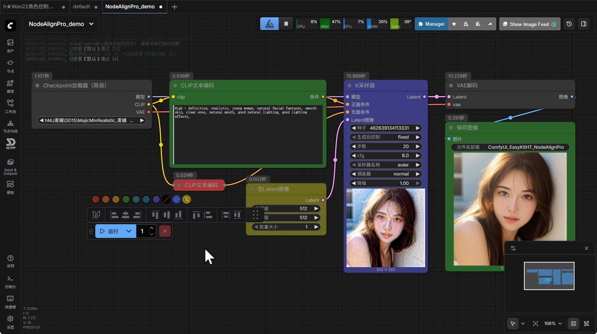
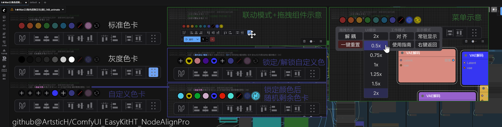
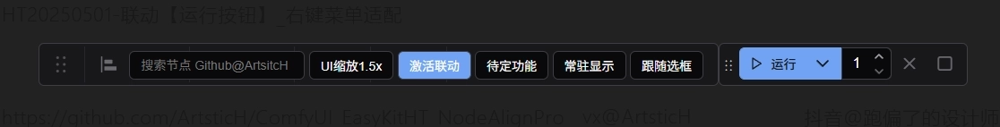
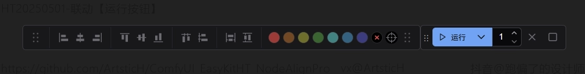
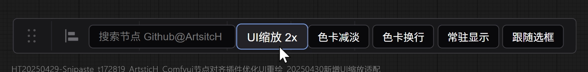
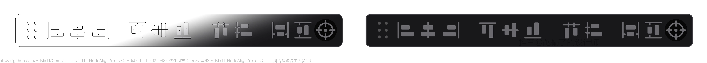

# ComfyUI_EasyKitHT_NodeAlign Pro 🎨

[](https://github.com/ArtsticH/ComfyUI_EasyKitHT_NodeAlignPro/stargazers)  [](LICENSE)  [](README_ZH.md)  [](README.md)

## 📋 项目简介

**ComfyUI_EasyKitHT_NodeAlignPro** 由设计师独立开发，是一个功能强大的ComfyUI插件，提供全新对齐工具和专业的节点色彩管理系统。该插件内置对齐工具的布局更符合设计行业通用的操作逻辑和体验，多种上色模式的上色工具更合理，新增实时预览取色器方便快速上色。该插件旨在提升ComfyUI用户的工作效率，通过直观的界面和丰富的功能简化节点布局与颜色管理流程。

---

## 🔥 新版v2.0.3_rc更新说明

**新版v2.0.3_rc**全新重构了`v1.0.4_rc`旧版UI及底层逻辑，彻底重写v2.0.3_rc版，全新的UI图标和界面交互逻辑。
基础代码和构思早已于今年6-7月份基本完成，由于本人近期较忙，搁置了挺久迟迟没有更新。这两天抽空更新了下，在尽可能保留上一版UI及交互习惯的前提下，重新设计了相关UI，基本上可以说是全部重构了相关逻辑（详见下图）。

#### ✅ 新版效果演示

 



#### 如果觉得还可以，欢迎帮忙点下**⭐Star**，您的鼓励就是我最大的动力~

<details>
  <summary><b>⚠️关于新版ComfyUI Node2.0 特别说明...</b><i>（点击展开/收起）</i></summary>
⚠️注：关于多种对齐模式，可```尝试Alt键+对齐按钮``` 体验下新的```彩蛋功能```里的```全新对齐方式```。
（注意```新版Node2.0测试版```的对齐相关功能目前还不够稳定，存在各种换算误差的累积偏移问题 (复现：可以来回开启/关闭ComfyUI原生的Node2.0测试版开关，就会发现，节点会累积误差，尺寸、坐标会不断的偏移。因此，暂时不作适配(虽然已经适配好Node2.0了，但还是```暂时移除适配Node2.0的逻辑```，后面```稍微稳定些会更新回来```))）

⚠️注：```💫全新上色系统``` ```💫人性化交互设计``` ```💫全新取色器(原创设计)``` 这三大板块均进行了不同程度的重构，且尽可能保留了```v1.0.4_rc版```的基础操作逻辑，由于平时较忙且业余开发(非专业程序猿)，```仓促更新难免会有不少bug```，还请大家帮忙测试，欢迎提交Issue反馈，感谢各位支持和理解！ 
</details>

<details>
  <summary><b>⚠️旧版v1.0.4_rc UI界面...</b><i>（点击展开/收起）</i></summary>

**旧版v1.0.4_rc**： 只提供基础的节点对齐工具和固定的上色工具。
 
  
  
  
</details>

## ✨ 核心功能 (已正式上线)

| 💫智能对齐系统    | 💫全新上色系统 | 💫人性化交互设计   | 💫全新取色器(原创设计) |
|---------------------------|---------------------------|---------------------------|---------------------------|
| ✅ 多种对齐模式        | 🖼️ 一键式颜色管理方案     | 🖱️ 悬浮式工具面板         | ✅ 原生JS/CSS实现全新取色系统     |
| 📐 动态间距分布算法        | 🔗 实时联动显示取色效果        | 🧩 全新自定义配置       | 🎨 色卡模式: 彩色/灰度/自定义     |
| 👥 多节点组协同操作        | 💾 自定义色卡收藏与恢复系统        | 💾 布局记忆与恢复系统     | 👏 色卡：随机/收藏/移除/以及手动添加    |  

### 🎨 颜色管理模块
- **七种预设颜色**：快速应用标准颜色到选中节点
- **灰度色板**：按住**Shift键**切换至灰度颜色模式【v2.0.1_rc新增】
- **自定义色板**：按住**Alt键**进入自定义颜色模式【v2.0.1_rc新增】
- **颜色收藏**：**Ctrl+Alt组合**锁定/解锁自定义颜色【v2.0.1_rc新增】
- **随机颜色**：点击随机颜色按钮即可随机一种颜色【v2.0.1_rc新增】
- **超级随机色**：按**Alt键** + **随机颜色按钮**可一次性随机7种颜色，并对选中节点实时随机上色【v2.0.1_rc新增】
- **智能取色器**：内置适配ComfyUI节点的**HSB/RGB实时取色器**【v2.0.1_rc新增】（0依赖，纯原生js+css开发设计）
- **实时预览节点调色**：实时预览颜色应用到节点的效果【v2.0.1_rc新增】（0依赖，纯原生js+css开发设计）

### 🔧 节点对齐工具
- **基础对齐**：左对齐、右对齐、顶部对齐、底部对齐
- **居中分布**：垂直居中和水平居中
- **等距分布**：水平等距分布和垂直等距分布
- **尺寸统一**：等宽和等高调整
- **智能模式**：按**Alt键** + 点击对应**对齐按钮**可实现反向基准对齐【v2.0.1_rc新增】

### 🎯 高级特性
- **拖拽容器**：可自由拖拽和缩放的操作面板
- **联动模式**：与ComfyUI运行按钮联动定位
- **显示模式**：常驻显示或跟随选框自动显示
- **右键菜单**：丰富的设置选项和快捷操作
- **节点选择**：多种选择工具和魔棒功能  （开发调试中...）
- **重命名工具**：批量重命名节点功能    （开发调试中...）

---

## 🚀 安装方法

### 方法一：Git克隆（推荐）
```
cd ComfyUI/custom_nodes
git clone https://github.com/ArtsticH/ComfyUI_EasyKitHT_NodeAlignPro.git
```

### 方法二：手动安装
1. 打开本项目地址：https://github.com/ArtsticH/ComfyUI_EasyKitHT_NodeAlignPro
2. 下载插件压缩包（`<>Code` > `Download ZIP`）
3. 解压到 `ComfyUI/custom_nodes` 目录 （注意正确目录层级应为：`ComfyUI/custom_nodes/ComfyUI_EasyKitHT_NodeAlignPro`）
4. 重启ComfyUI

### 方法三：ComfyUI管理器
1. 在ComfyUI Manager管理器搜索 "NodeAlignPro"（若没有，请先安装ComfyUI Manager）
2. 找到`ComfyUI_EasyKitHT_NodeAlignPro`，点击安装
3. 重启ComfyUI

### 补充：Git更新（需先手动导航至ComfyUI_EasyKitHT_NodeAlignPro目录内）
```
git fetch --all
```

---

### 🚀 快速开始（简要指南）
成功安装NodeAlignPro之后，基础操作(仅供参考)

1. **节点上色**：进入ComfyUI选中任一节点 > 点击NodeAlignPr面板（以下简称NAP面板）内任意**颜色按钮**即可（🔴🟠🟡🟢🔵🟣🟤,`清除颜色` `取色器` `随机颜色`）；
2. **自定义颜色**：选中任一节点 > 点击NAP面板内**取色器按钮**即可；
3. **节点对齐**： 选中任一节点 > 点击NAP面板内任意**对齐按钮**即可；
4. **反向对齐**：选中任一节点 > 按**Alt键** + 点击对应**对齐按钮**可实现反向基准对齐；
    └例：`左对齐` →选中多个节点 > 按`Alt键`+`左对齐按钮`，则以`最右侧节点`为`基准`进行`左对齐`（默认左对齐是以`最左侧节点`为`基准`进行`左对齐`）；
5. **拖动NAP面板**：无需选中任何节点 > 点击NAP面板左右两侧的按钮，出现四向箭头光标（↕↔）即可拖动
5. **重置设置**：无需选中任何节点 > 在NAP面板内 >【鼠标右键】 >【一键重置】 即可；
7. **进阶技巧**：请参阅下面**使用指南**👇。

<details>
  <summary><b>🖥️ 《使用指南》...</b></summary>

### 基本操作
1. **启动插件**：ComfyUI启动后，插件自动加载
2. **显示/隐藏**：通过右键菜单或快捷键控制显示
3. **拖拽移动**：拖动标题栏或分隔线移动面板
4. **缩放调整**：通过右键菜单调整UI缩放比例

### 颜色模式切换
| 按键组合 | 模式说明 | 功能描述 |
|---------|---------|---------|
| **无按键** | 默认模式 | 七种预设颜色 |
| **Shift** | 灰度模式 | 黑白灰系列颜色 |
| **Alt** | 自定义模式 | 自定义颜色管理 |
| **Ctrl+Alt** | 锁定模式 | 锁定/解锁自定义颜色 |

### 对齐操作
1. 在ComfyUI画布上选择2个或更多节点
2. 点击对齐面板上的相应按钮：
   - **左对齐**：所有节点向左对齐
   - **垂直居中**：所有节点垂直居中
   - **右对齐**：所有节点向右对齐
   - **顶部对齐**：所有节点向顶部对齐
   - **水平居中**：所有节点水平居中
   - **底部对齐**：所有节点向底部对齐

### 高级技巧
- **Alt+对齐按钮**：使用"反向基准"进行对齐
- **双击取色器预览**：切换节点整体/仅标题上色模式
- **右键菜单**：访问完整设置和重置功能
- **容器联动**：将操作面板与运行按钮联动定位

</details>

## 🐛 常见问题

##### Q: 插件不显示怎么办？
A: 检查是否正确安装到custom_nodes目录，重启ComfyUI，查看浏览器控制台是否有错误。

##### Q: 颜色无法应用到节点？
A: 确保已选中节点，检查节点是否处于锁定状态，尝试刷新页面。

##### Q: 对齐功能无效？
A: 确保选中2个或更多节点，检查节点选择状态，尝试清除选择后重新选择。

##### Q: 如何重置所有设置？
A: 右键菜单 → "一键重置"，或清除浏览器localStorage。

##### Q: 如何显示插件操作日志？
A: 直接输入控制台命令：``` document.getElementById('hDebugInfo_V2')?.style.setProperty('display', 'block', 'important'); ```

---

## ⚙️ 技术特性

### 架构设计
- **🌐原生开发**：仅使用原生JS+CSS从零实现
- **🔒零依赖**：不依赖任何第三方框架/库或现有代码段<small  style="color:#999">（仅在__init__.py中导入了必要的Python官方内置的OS模块）</small>
- **📴全离线运行**：全本地化运行，不依赖任何网络资源，确保本地化私有部署的安全可靠性
- **📄单文件特性**：单文件集中开发，虽整体略显冗长，但方便集中管理，和调试维护<small  style="color:#999">（哪怕只用Windows自带的记事本，事实上很多次的小改动就是直接用记事本微调测试的）</small>
- **🧩模块化设计**：颜色、对齐、UI控制器分离<small  style="color:#999">（在单文件基础上做到模块分离，在一定程度上方便后续开发）</small>
- **🏷️规范化命名**：自定义了一套自己风格的命名，做明显区分
- **💻响应式布局**：自适应不同屏幕分辨率
- **⚡性能优化**：必要环节的节流和防抖处理
- **💾状态持久化**：保存用户设置到本地存储
- **✅真开源/不混淆**：完整保留必要的注释和变量参数名，不混淆代码进行伪开源

### 颜色系统
- **HSB/RGB/HEX**：完整颜色空间支持
- **实时预览**：节点SVG预览实时更新
- **智能分配**：多节点颜色智能分配算法
- **CSS变量**：统一主题颜色管理

### UI组件
- **可拖拽容器**：支持边界检测和弹性回弹
- **下拉菜单**：平滑动画和悬停交互
- **滑块控件**：精确的颜色值调整
- **图标系统**：SVG矢量图标渲染

<details>
  <summary><b>🖥️ 显示设置...</b></summary>

```
// 显示模式
- 常驻显示：始终显示操作面板
- 跟随选框：选中2个以上节点时自动显示

// UI缩放
- 0.5x, 0.75x, 1x, 1.25x, 1.5x, 2x
```

</details>

<details>
  <summary><b>🔗 联动设置...</b></summary>

```
// 拖拽方式
- 解耦：独立拖拽操作面板
- 联动：与运行按钮联动定位

// 工作模式
- 对齐模式：基础对齐功能
- 专业模式：高级选择工具
```

</details>

<details>
  <summary><b>📁 NodeAlignPro文件结构...</b></summary>

```
ComfyUI_EasyKitHT_NodeAlignPro/
├── __init__.py
├── README.md            # English Documentation
├── README_ZH.md            # 中文说明文档
├── LICENSE              # 许可证文件
├── pyproject.toml
└── ArtsticH/              # 项目文件
    ├── hNodeAlignPro.js      # 主程序文件
└── Example/
    ├── NodeAlignPro_demo.json  # 测试工作流
    └── NodeAlignPro_demo.png   # 示例图片(内含测试工作流)
```

</details>

## 🔄 更新日志

### v2.0.3_rc (最新发布)
- 完善新版(v2.0.3_rc)界面提示
- 修复了一些bug
- 重新便些md教程文档(中英双语)

<details>
  <summary><b>📄 历史版本...</b></summary>

##### v2.0.2_rc (2025-12-22)
### v2.0.1_rc (2025-12-22)【2.0版发布】
- 新增Shift/Alt/Ctrl组合键模式
- 改进取色器性能和稳定性
- 添加节点预览功能
- 优化UI交互体验

##### v1.0.4_rc (2025-08-14)
##### v1.0.3_rc (2025-05-01)
##### v1.0.2_rc (2025-04-30)
### v1.0.1_rc (2025-04-29)【1.0版发布】
- 初始版本发布
- 完整的对齐和颜色功能
- 可拖拽容器系统
- 取色器工具集成

</details>
<details>
  <summary><b>📄 历史更新日志...</b></summary>

```
v2.0.2_rc   8a12160: 🔥NodeAlignPro版本大更新,优化文件结构(全新UI, 更全的节点上色系统)→详见readme文档
----------------
v2.0.1_rc   dd2a09f: 🔥NodeAlignPro版本大更新已发布（全新UI, 更全的节点上色系统）
d90bd02: 🔥Update Preview (A Major Update for the Upcoming Version 😁)→See README for details.🔥重大更新预告(近期版本将会大更新😁)→详见readme文档
----------------
v1.0.4_rc   b77a9d7: FIX README, ht历史记录优化
----------------
v1.0.3_rc   a62e3a6: Fix the ui scaling adaptation issue, The interlocking control function has been newly added.
d067502: remove res, add hPic, FIX README,FIX README_ZH.md
----------------
v1.0.2_rc   b11f325: upload README
cb93ffa-461032d: README修改
4e60dc2: Fixed REEADME, Rename some img, Add README_ZH.md
fac4c81: UPLoad README , Create README_ZH.md
9f1839e: README修改-新增UI缩放适配
ef5735d: 新增UI缩放，修复旧版颜色移除不生效情况
8ac01db: 新增主要功能：对齐分布、节点上色。修改Readme图片显示异常
----------------
v1.0.1_rc   2926b82: README修改
10749c7: ComfyUI_EasyKitHT_NodeAlignPro是一个针对全新开发设计的ComfyUI节点对齐插件、节点上色插件。
    全新视觉UI，相对更符合广大设计师朋友们的一贯操作逻辑。皆为大家提供一个相对美观的使用体验。
    新增主要功能：对齐分布、节点上色。
----------------
ca28236: Initial commit
----------------
# @Artstich_Example
# @name         ComfyUI_EasyKitHT_NodeAlignPro (ComfyUI Plugin)
# @description  ComfyUI_EasyKitHT_NodeAlignPro is a lightweight ComfyUI node alignment and node coloring tool 
#               for refactoring and rewriting the UI based on the open-source projects Comfyui-Align and Comfyui-Nodealigner.
# @author Artstich  @date 2025-06-15  @version v2.0.3_rc  @license GPL-3.0
# @see https://github.com/ArtsticH/ComfyUI_EasyKitHT_NodeAlignPro
 ```

</details>

## 🤝 贡献指南

- 欢迎通过以下方式参与改进：  
```提交使用反馈```、`New Issue`、```改进代码逻辑```、`Fork & PR`、```完善多语言文档```、```分享你的创意节点布局```、```分享你的自定义色卡```

## 📜 许可证

本项目采用 **GPL-3.0** 许可证。详细信息请查看 [LICENSE](LICENSE) 文件。

## 👥 贡献者

- [ArtsticH](https://github.com/ArtsticH) - 项目创建者和主要开发者
- ISISUES: [@JGDMGJAPT](https://github.com/jgdmgjapt) 、[@MAOMAOCHONGNE](https://github.com/MAOMAOCHONGNE)、[@aimposer](https://github.com/ArtsticH/ComfyUI_EasyKitHT_NodeAlignPro/issues/3)、[@Rock-suv](https://github.com/ArtsticH/ComfyUI_EasyKitHT_NodeAlignPro/issues/4)、
- 感谢所有提供帮助的设计师、开发者、测试者、ComfyUI用户和反馈者

## 🌐 相关链接

- [GitHub仓库](https://github.com/ArtsticH/ComfyUI_EasyKitHT_NodeAlignPro)　|　[问题反馈](https://github.com/ArtsticH/ComfyUI_EasyKitHT_NodeAlignPro/issues)　|　[ComfyUI社区](https://github.com/comfyanonymous/ComfyUI)　|　[ComfyUI-Manager](https://github.com/Comfy-Org/ComfyUI-Manager/tree/main)
- 作者视频教程链接：https://www.bilibili.com/video/BV1V7G9z9EcU （此链接为`v1.0.4_rc`旧版教程，v2.0.3_rc新版待录制）
<div align="center">
  <video src="https://www.bilibili.com/video/BV1V7G9z9EcU/" width="70%" poster=""> </video>
</div>

---

👨💻 设计师业余开发的第一个小项目，欢迎反馈使用问题
⚠️ 可能存在未测试场景的异常，请通过Issues报告（如果觉得还可以，欢迎帮忙**Star⭐**一下，您的鼓励就是我最大的动力~）欢迎有兴趣的小伙伴们一起加入！

<small  style="color:#999">本文档更新于：2025年12月24日 01：51 @[ArtsticH](https://github.com/ArtsticH/ComfyUI_EasyKitHT_NodeAlignPro)·2025</small>